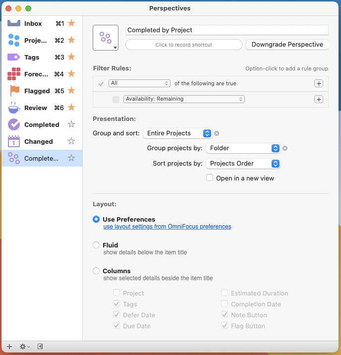

# Week in Review

Week in Review is a plugin for [OmniFocus Pro][omnifocus] that extracts a week
of completed tasks for you to review.

## Installation

1.  Install [`week-in-review.omnifocusjs`](week-in-review.omnifocusjs) as a
    [plug-in][plug-in].
1.  Add the "Completed by Project" perspective it depends on in
    **Perspectives > Add Perspective**.

    - Uncheck "Availability: Remaining" in **Filter Rules**.
    - Group and sort: Entire Projects
         - Group projects by: Folder
         - Sort projects by: Projects Order

    

## Use

1.  Click **Automation > Week in Review**
1.  Enter the week start date.
1.  Click **OK**.

Week in Review will extract the tasks you completed that week to a new Folder
and Focus on it.

You can then do what you want with it; I normally right-click the Week in Review
folder in the main view, click **Copy as TaskPaper**, and then paste my tasks
into an editor. I edit for clarity and send them to stakeholders.

[omnifocus]: https://www.omnigroup.com/omnifocus/
[plug-in]: https://omni-automation.com/actions/action-01.html
